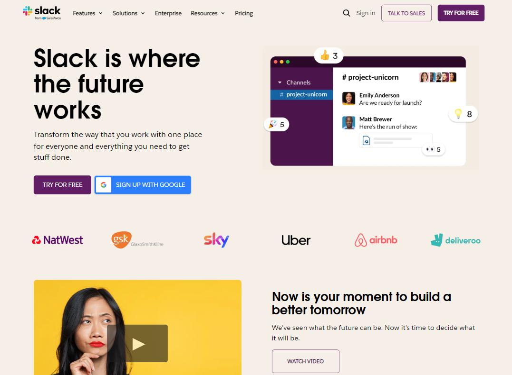
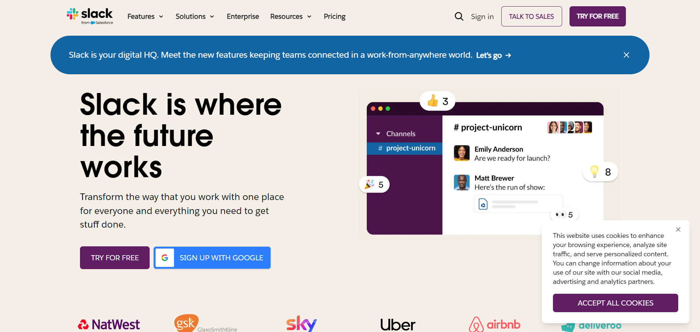
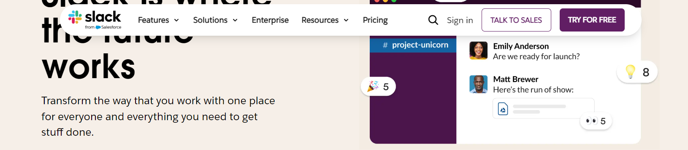
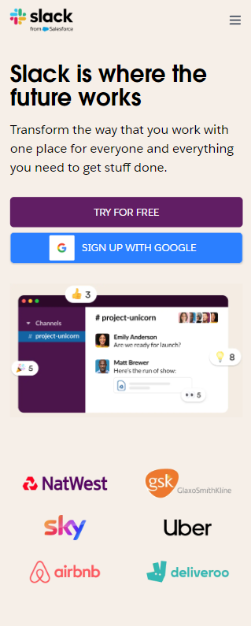
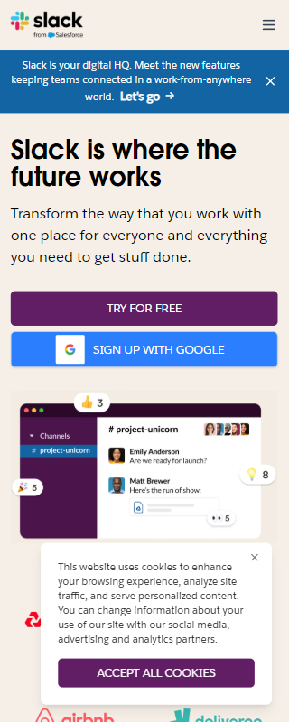
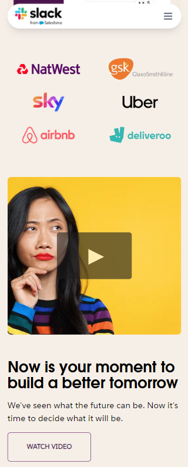
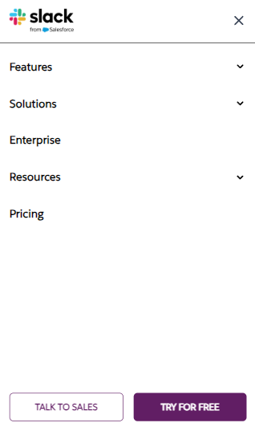

# Slack Landing Page

A responsive recreation of Slack's landing page built with Next.js, TypeScript, and Tailwind CSS.

## Live Demo

Check out the live demo: [Slack Landing Page](https://slack-lp.vercel.app)

## Screenshots

### Desktop View






### Sticky Header



### Mobile View



### Mobile Menu








## Tech Stack

- Next.js
- TypeScript
- Tailwind CSS
- React

## Running Locally

1. Clone the repository:

```bash
git clone https://github.com/VinayakaHegade/slack-landing-page.git
cd slack-landing-page
```

2. Install dependencies:

```bash
npm install
```

3. Start the development server:

```bash
npm run dev
```

4. Open [http://localhost:3000](http://localhost:3000) with your browser to see the result.

## Project Structure

```plaintext
slack-landing-page/
├── app/
│   ├── layout.tsx        # Root layout with fonts and metadata
│   ├── page.tsx          # Home page component
│   └── globals.css       # Global styles and Tailwind imports
├── components/
│   ├── navbar.tsx        # Responsive navigation
│   ├── hero-section.tsx
│   ├── client-logos.tsx
│   ├── hero-banner.tsx
│   ├── cookie-banner.tsx
│   └── Icons.tsx
└── public/
    ├── logo/             # Company logos
    ├── images/           # Site images
    └── screenshots/      # Project screenshots
```
